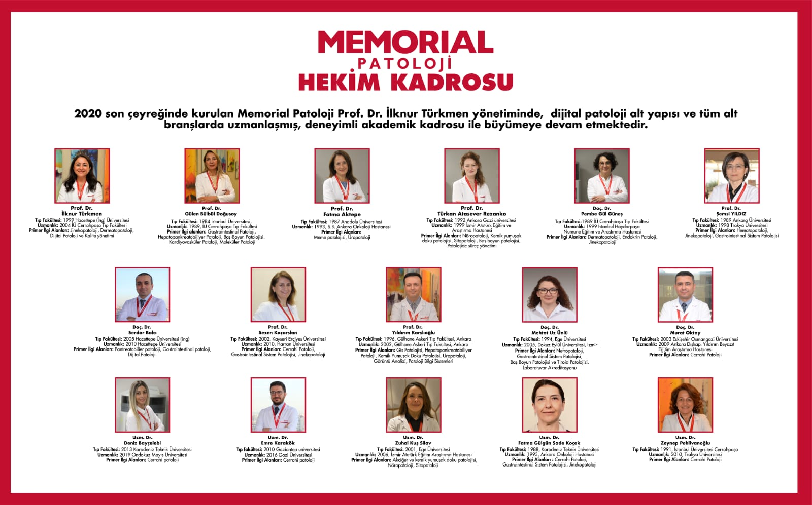
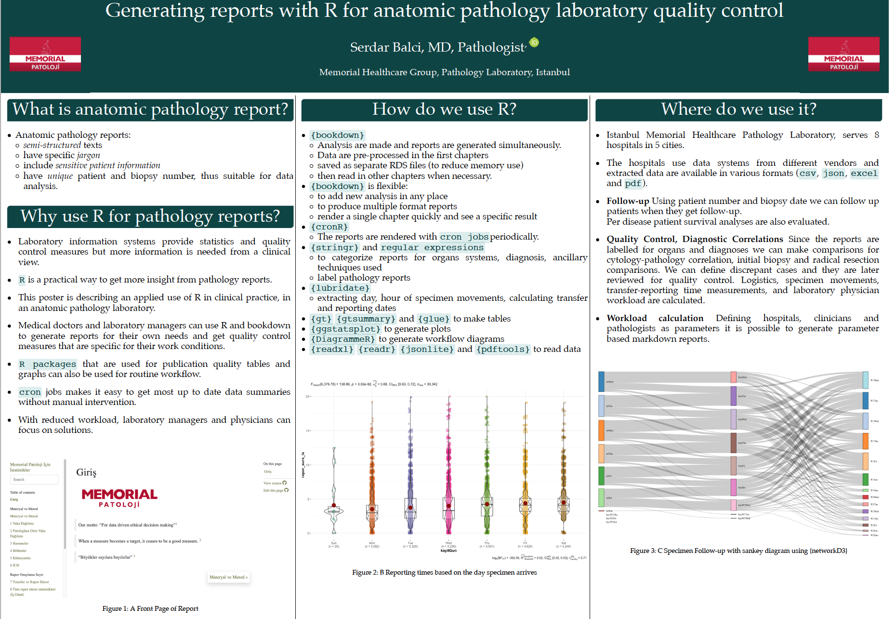
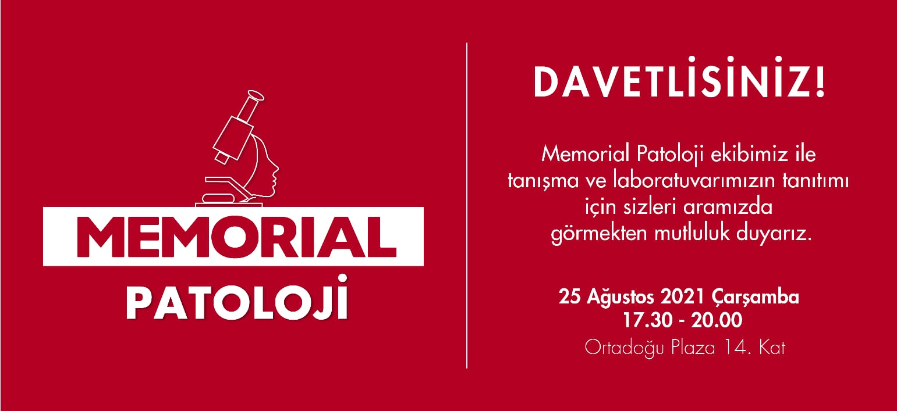

Memorial Patoloji Laboratuvarı
================

# [MemorialPath.github.io](https://memorialpath.github.io/)

------------------------------------------------------------------------

## Memorial Patoloji Laboratuvarı

-   [Ana Sayfa](https://patoloji.memorial.com.tr/)

-   [Hastane
    Sayfası](https://www.memorial.com.tr/tibbi-birimlerimiz/patoloji-merkezi)

-   [Patologlar](https://patoloji.memorial.com.tr/Home/Index#hekimlerimiz)

------------------------------------------------------------------------

## Laboratuvara ait bazı istatistikler

-   Bu istatistikler en son 23-04-2022 tarihinde güncellenmiştir.

-   14-12-2020 ile 19-04-2022 tarihleri arasında:

    -   Toplam 74674 vaka raporlanmıştır.

------------------------------------------------------------------------
## Dijital Patoloji

- [https://patoloji.memorial.com.tr/Home/DijitalPatoloji](https://patoloji.memorial.com.tr/Home/DijitalPatoloji)

- Laboratuvar altyapısında dijital patoloji için Sectra ve Aperio kullanılmaktadır.

---
## Projeler

---

### Patoloji Atlası

**Pathology Atlas and Notes for Medical Students: See and Learn**

- [https://www.patolojiatlasi.com/](https://www.patolojiatlasi.com/)

- [https://www.patolojiatlasi.com/EN/](https://www.patolojiatlasi.com/EN/)

- [https://www.patolojinotlari.com/](https://www.patolojinotlari.com/)

---

### R/Medicine 2021 Generating reports with R for anatomic pathology laboratory quality control

[R/Medicine 2021](https://r-medicine-2021.netlify.app/)

[Abstract](./projects/RMedicine2021/Generating%20reports%20with%20R%20for%20anatomic%20pathology%20laboratory%20quality%20control.nb.html)

[Poster](https://spatial.chat/s/R-Medicine2021?room=231309)

---

### ECDP2022 Validation Study

[ECDP2022](https://www.ecdp2022.org/)

Implemantation of Digital Pathology Workflow for Routine Primary Diagnosis in a Large Private Hospital Network

[Abstract](./projects/ECDP2022/Validation-Study-ECDP2022-Abstract.md)

---

## Toplantılar

 
 
---

### Tanışma Toplantısı 25 Ağustos 2021 17:30-20:00

<iframe width="560" height="315" src="https://www.youtube.com/embed/zXAVLQaA8z4" title="YouTube video player" frameborder="0" allow="accelerometer; autoplay; clipboard-write; encrypted-media; gyroscope; picture-in-picture" allowfullscreen></iframe>

 
 
---

###  Memorial Klinikopatoloji Toplantıları: Beyin Tümörlerinde 2021 DSÖ Sınıflaması 28 Aralık 2020 / 17.00 - 18.00 

- Moderatör  
Prof. Dr. İlknur Türkmen 
- Günümüze kadar olan DSÖ beyin tümörleri sınıflamasına genel bakış  
Prof. Dr. Türkan Atasever Rezanko, Memorial Sağlık Grubu Patoloji Bölümü 
- 2021 DSÖ sınıflamasında bizi neler bekliyor?  
Prof. Dr. Tarık Tihan, California Üniversitesi, San Francisco, Patoloji Bölümü, Nöropatoloji Ünitesi

<iframe width="560" height="315" src="https://www.youtube.com/embed/gQEgGhWjJ_Y" title="YouTube video player" frameborder="0" allow="accelerometer; autoplay; clipboard-write; encrypted-media; gyroscope; picture-in-picture" allowfullscreen></iframe>

 

---
## Memorial Patoloji Bilgilendirme Videoları

 

### Patoloji nedir?

<iframe width="560" height="315" src="https://www.youtube.com/embed/Kypw67buJ6I" title="YouTube video player" frameborder="0" allow="accelerometer; autoplay; clipboard-write; encrypted-media; gyroscope; picture-in-picture" allowfullscreen></iframe>

 

### Adım Adım Memorial Patoloji

<iframe width="560" height="315" src="https://www.youtube.com/embed/HYTqkBAHp_I" title="YouTube video player" frameborder="0" allow="accelerometer; autoplay; clipboard-write; encrypted-media; gyroscope; picture-in-picture" allowfullscreen></iframe>

 

### Patoloji raporları ne anlatıyor?  

<iframe width="560" height="315" src="https://www.youtube.com/embed/videoseries?list=PLeO8DwElpbKcg-y-o05ksQqJElZFJoxXe" title="YouTube video player" frameborder="0" allow="accelerometer; autoplay; clipboard-write; encrypted-media; gyroscope; picture-in-picture" allowfullscreen></iframe>

 

### Biyopsi nedir?

<iframe width="560" height="315" src="https://www.youtube.com/embed/0JzNfZztyBE" title="YouTube video player" frameborder="0" allow="accelerometer; autoplay; clipboard-write; encrypted-media; gyroscope; picture-in-picture" allowfullscreen></iframe>

 

### Sitoloji nedir?

<iframe width="560" height="315" src="https://www.youtube.com/embed/ptUaJvkhMwM" title="YouTube video player" frameborder="0" allow="accelerometer; autoplay; clipboard-write; encrypted-media; gyroscope; picture-in-picture" allowfullscreen></iframe>

 

### Frozen section nedir?

<iframe width="560" height="315" src="https://www.youtube.com/embed/umA0MY4Cz2w" title="YouTube video player" frameborder="0" allow="accelerometer; autoplay; clipboard-write; encrypted-media; gyroscope; picture-in-picture" allowfullscreen></iframe>

 

### Meme kanserinin tanısı nasıl konuluyor?

<iframe width="560" height="315" src="https://www.youtube.com/embed/gIy7TMSwQPg" title="YouTube video player" frameborder="0" allow="accelerometer; autoplay; clipboard-write; encrypted-media; gyroscope; picture-in-picture" allowfullscreen></iframe>

 

### Hormon pozitif ve HER2 pozitif meme kanseri tanısında patolojik değerlendirme nasıl yapılıyor?  

<iframe width="560" height="315" src="https://www.youtube.com/embed/h5wkk1XU4wY" title="YouTube video player" frameborder="0" allow="accelerometer; autoplay; clipboard-write; encrypted-media; gyroscope; picture-in-picture" allowfullscreen></iframe>

 

### Kolonoskopide alınan örneklerin patolojik incelemeleri nasıl yapılıyor?

<iframe width="560" height="315" src="https://www.youtube.com/embed/92LBYZfrnn8" title="YouTube video player" frameborder="0" allow="accelerometer; autoplay; clipboard-write; encrypted-media; gyroscope; picture-in-picture" allowfullscreen></iframe>

 

### Gastroenterolojide patolojik inceleme nasıl yapılıyor?

<iframe width="560" height="315" src="https://www.youtube.com/embed/ZnGSRSpWvtM" title="YouTube video player" frameborder="0" allow="accelerometer; autoplay; clipboard-write; encrypted-media; gyroscope; picture-in-picture" allowfullscreen></iframe>

