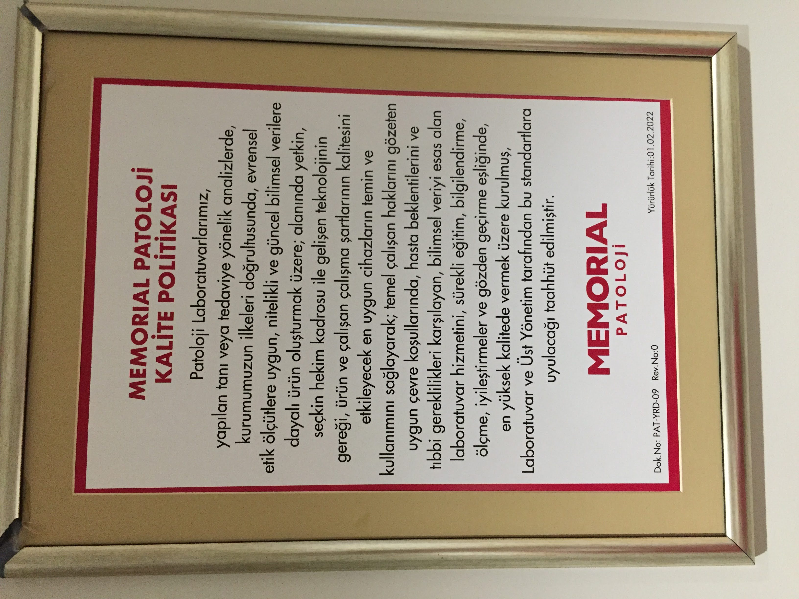
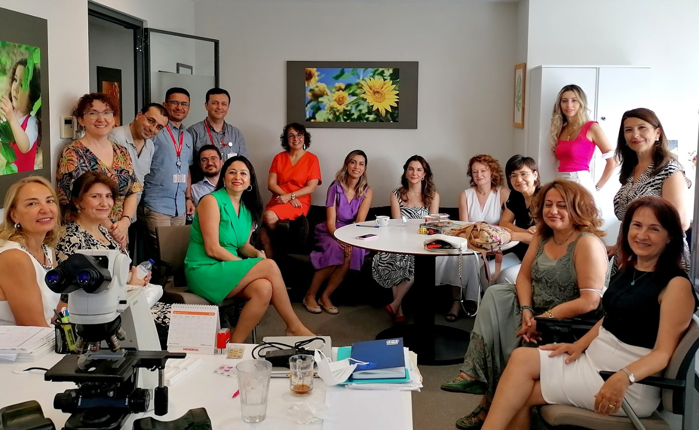

```{r global, include = FALSE}
knitr::opts_chunk$set(
  collapse = TRUE,
  include = FALSE,
  comment = "#>"
)
```


# [MemorialPath.github.io](https://memorialpath.github.io/)

https://memorial.patoloji.dev/

---

## Memorial Patoloji Laboratuvarı


- [Ana Sayfa](https://patoloji.memorial.com.tr/)

- [Hastane Sayfası](https://www.memorial.com.tr/tibbi-birimlerimiz/patoloji-merkezi)

- [Memorial Patoloji Patologlar](https://patoloji.memorial.com.tr/Home/Index#hekimlerimiz)


[](./images/Memorial-Patoloji-Hekim-Kadrosu.jpeg)


- Memorial Patoloji Kalite Politikası


[](./images/Memorial-Patoloji-Kalite-Politikasi.JPG)


- Memorial Patoloji Patologlar


[](./images/Memorial-Patoloji-Patologlar.jpeg)


-   [Ilknur Turkmen](https://www.memorial.com.tr/en/doctors/ilknur-turkmen-1975)

-   [Gülen Bülbül Doğusoy](https://www.memorial.com.tr/doktorlar/gulen-bulbul-dogusoy)

-   [Fatma Aktepe](https://www.memorial.com.tr/doktorlar/fatma-aktepe)

-   [Türkan Atasever Rezanko](https://www.memorial.com.tr/doktorlar/turkan-atasever-rezanko)

-   [Pembe Gül Güneş](https://www.memorial.com.tr/doktorlar/pembe-gul-gunes)

-   [Şemsi Yıldız]()

-   [Serdar Balcı](https://www.memorial.com.tr/doktorlar/serdar-balci)

-   [Sezen Koçarslan](https://www.memorial.com.tr/doktorlar/sezen-kocarslan)

-   [Yıldırım Karslıoğlu](https://www.memorial.com.tr/doktorlar/yildirim-karslioglu-k)

-   [Mehtat Uz Ünlü](https://www.memorial.com.tr/doktorlar/mehtat-uz-unlu-k)

-   [Murat Oktay](https://www.memorial.com.tr/doktorlar/murat-oktay)

-   [Deniz Bayçelebi](https://www.memorial.com.tr/doktorlar/deniz-baycelebi)

-   [Emre Karakök](https://www.memorial.com.tr/doktorlar/emre-karakok)

-   [Fatma Gülgün Sade Koçak](https://www.memorial.com.tr/doktorlar/fatma-gulgun-sade-kocak-k)

-   [Zeynep Pehlivanoğlu](https://www.memorial.com.tr/doktorlar/zeynep-pehlivanoglu-k)

-   [Fadime Gül Salman](https://www.memorial.com.tr/doktorlar/fadime-gul-salman)

-   [Rukiye Nilgün Erdoğan](https://www.memorial.com.tr/doktorlar/rukiye-nilgun-erdogan)

-   [Zeynep Bayramoğlu]()

---

## Laboratuvara ait bazı istatistikler


```{r istatistiklerin okunmasi}
raporsayisi <- readLines(con = "./publicinfo/raporsayisi")
songuncelleme <- readLines(con = "./publicinfo/songuncelleme")
ilkrapor <- readLines(con = "./publicinfo/ilkrapor")
sonrapor <- readLines(con = "./publicinfo/sonrapor")

# text1 <- readLines(con = "./data/deneme.txt")
# text2 <- readr::read_file("./data/deneme.txt")

```


- Bu istatistikler en son `r songuncelleme` tarihinde güncellenmiştir.

- `r ilkrapor` ile `r sonrapor` tarihleri arasında:
    - Toplam `r raporsayisi` vaka raporlanmıştır.


---
