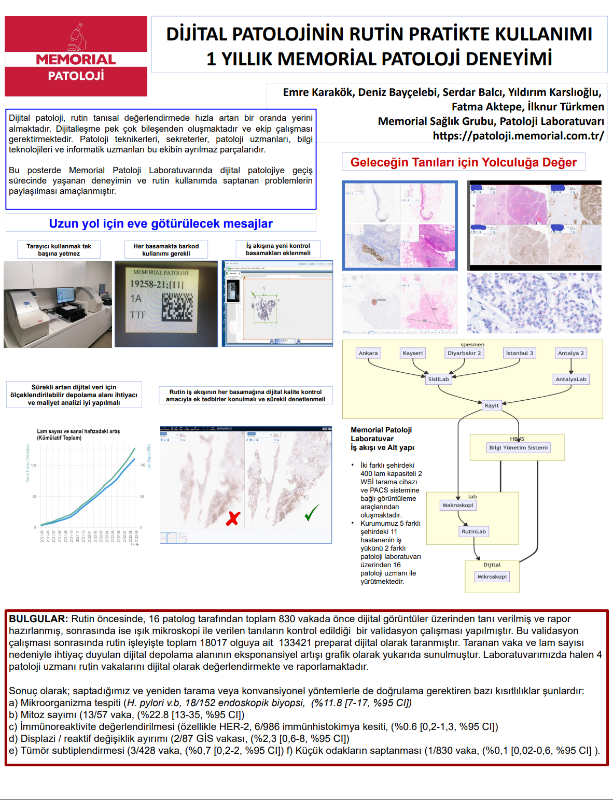
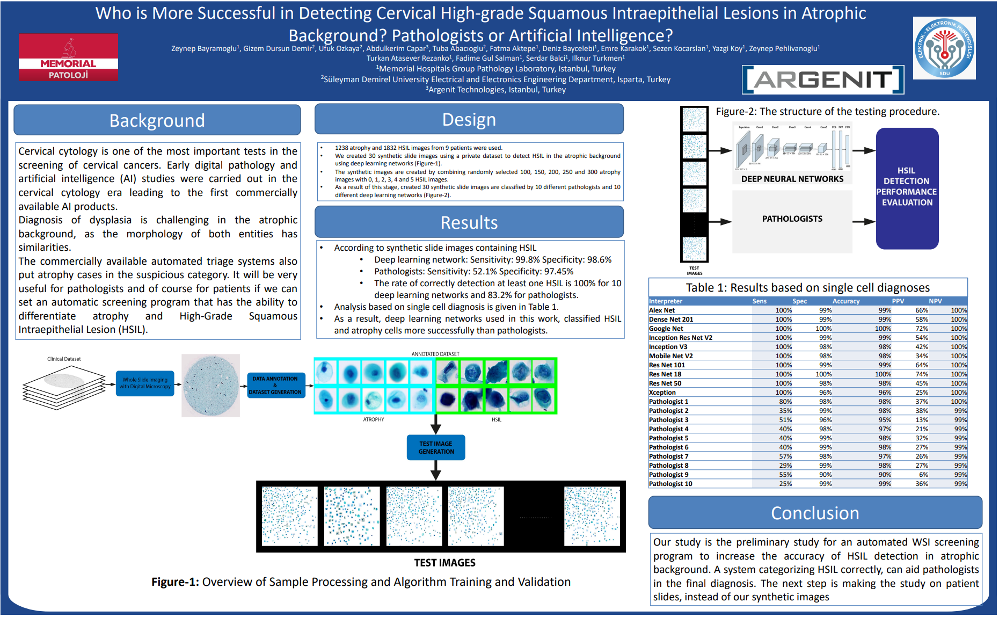
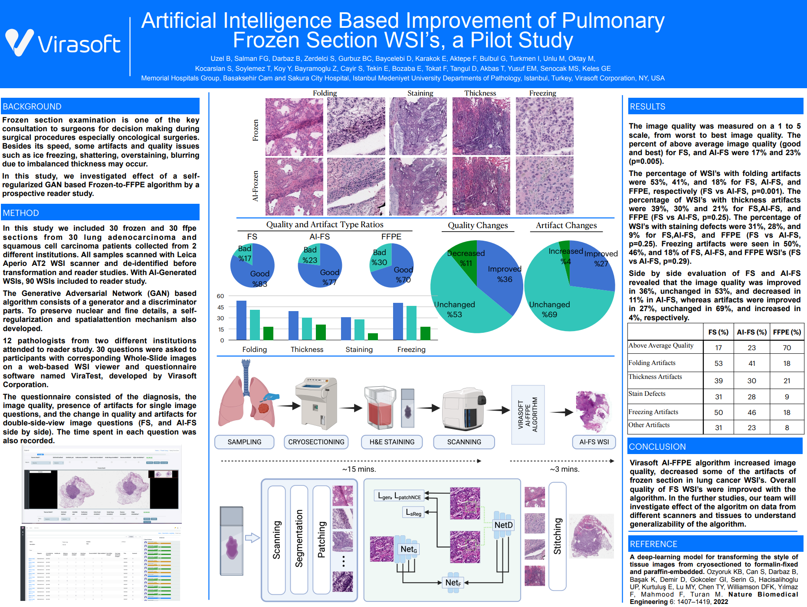

## Projeler  

### R/Medicine 2021  

**Generating reports with R for anatomic pathology laboratory quality control**  

[R/Medicine 2021](https://r-medicine-2021.netlify.app/)  

[Abstract](./projects/RMedicine2021/Generating%20reports%20with%20R%20for%20anatomic%20pathology%20laboratory%20quality%20control.nb.html)  

[Poster](https://spatial.chat/s/R-Medicine2021?room=231309)  

  

### ECDP2022 Validation Study  

[ECDP2022](https://www.ecdp2022.org/)  

**Implemantation of Digital Pathology Workflow for Routine Primary Diagnosis in a Large Private Hospital Network**  

[Abstract](./projects/ECDP2022/Validation-Study-ECDP2022-Abstract.md)  

### Ulusal Patoloj Kongresi 2022  

**DİJİTAL PATOLOJİNİN RUTİN PRATİKTE KULLANIMI: BİR YILLIK MEMORİAL DENEYİMİ**  

[Abstract](./projects/ulusal2022/dijital-patoloji-bir-yillik-deneyim.md)  

  

### USCAP 2023  

**Who is More Successful in Detecting Cervical High-grade Squamous Intraepithelial Lesions in Atrophic Background? Pathologists or Artificial Intelligence?**    

[Abstract](./projects/USCAP2023/atrophy-HSIL-smear-ai.png)  

Reference: Laboratory Investigation VOLUME 103, ISSUE 3, SUPPLEMENT, S1286, Abstract No: 1235, 100094, MARCH 2023 INFORMATICS DOI:<https://doi.org/10.1016/j.labinv.2023.100094> <https://li.uscap.org/article/S0023-6837(23)00037-5/fulltext>   

**Artificial Intelligence Based Improvement of Pulmonary Frozen Section WSI’s, a Pilot Study**  

[Abstract](./projects/USCAP2023/frozen-lung-ai.png)  

 

Reference: Laboratory Investigation VOLUME 103, ISSUE 3, SUPPLEMENT, S1675-1676, Abstract No:1606, 100101, MARCH 2023 PULMONARY, MEDIASTINAL, PLEURAL, AND PERITONEAL PATHOLOGY DOI:<https://doi.org/10.1016/j.labinv.2023.100101> <https://li.uscap.org/article/S0023-6837(23)00044-2/fulltext>  

# ECDP 2023

<iframe src="https://www.linkedin.com/embed/feed/update/urn:li:share:7075156255098462208" allowfullscreen="" title="Embedded post" width="504" height="821" frameborder="0"></iframe>

<blockquote class="twitter-tweet">
Pathologists from <a href="https://twitter.com/MemorialSaglik?ref_src=twsrc%5Etfw">@memorialsaglik</a> presented an exciting new results on their evaluation of Paige Prostate at ECDP! Overall, they found that &quot;AI sensitivity with pathologist specificity will improve patient care.&quot; <a href="https://twitter.com/hashtag/memorialsaglik?src=hash&amp;ref_src=twsrc%5Etfw">#memorialsaglik</a> #​memorialpathology <a href="https://t.co/K9KmBHZw9S">pic.twitter.com/K9KmBHZw9S</a>
&mdash; Paige (@paige_ai) <a href="https://twitter.com/paige_ai/status/1669390646598041610?ref_src=twsrc%5Etfw">June 15, 2023</a></blockquote>  

