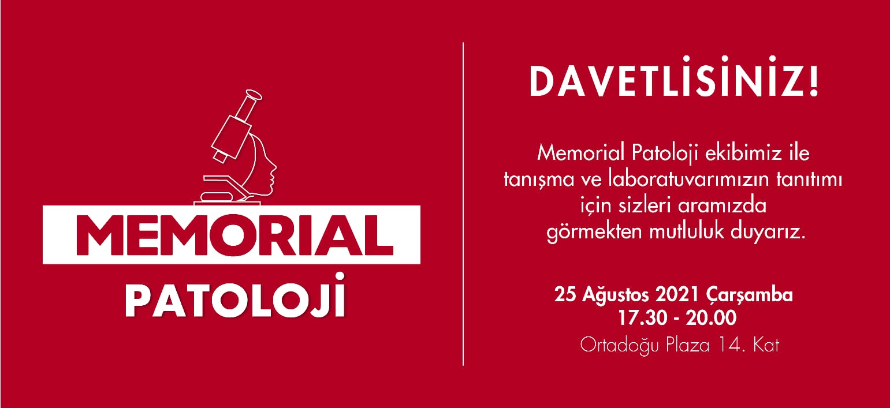

## Toplantılar

 
---

### Tanışma Toplantısı 25 Ağustos 2021 17:30-20:00

<iframe width="560" height="315" src="https://www.youtube.com/embed/zXAVLQaA8z4" title="YouTube video player" frameborder="0" allow="accelerometer; autoplay; clipboard-write; encrypted-media; gyroscope; picture-in-picture" allowfullscreen></iframe>

 
---

###  Memorial Klinikopatoloji Toplantıları: Beyin Tümörlerinde 2021 DSÖ Sınıflaması 28 Aralık 2020 / 17.00 - 18.00 

- Moderatör  
Prof. Dr. İlknur Türkmen 
- Günümüze kadar olan DSÖ beyin tümörleri sınıflamasına genel bakış  
Prof. Dr. Türkan Atasever Rezanko, Memorial Sağlık Grubu Patoloji Bölümü 
- 2021 DSÖ sınıflamasında bizi neler bekliyor?  
Prof. Dr. Tarık Tihan, California Üniversitesi, San Francisco, Patoloji Bölümü, Nöropatoloji Ünitesi

<iframe width="560" height="315" src="https://www.youtube.com/embed/gQEgGhWjJ_Y" title="YouTube video player" frameborder="0" allow="accelerometer; autoplay; clipboard-write; encrypted-media; gyroscope; picture-in-picture" allowfullscreen></iframe>

---

